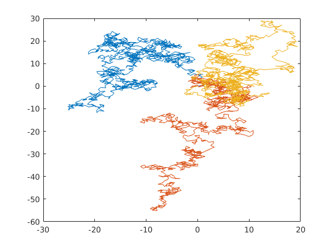
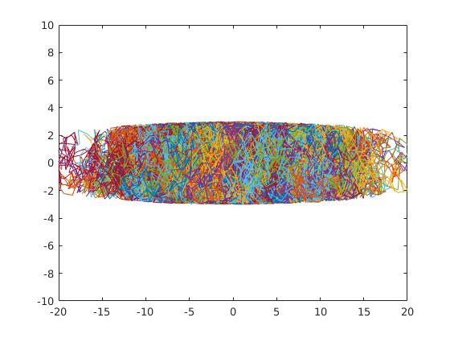
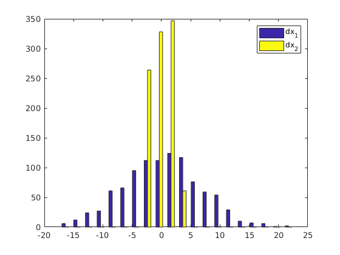
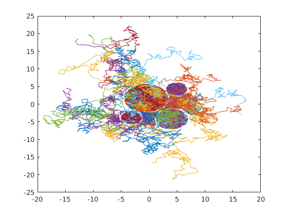
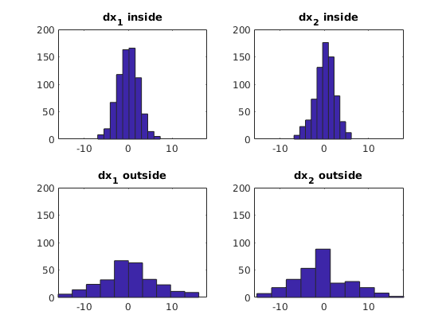
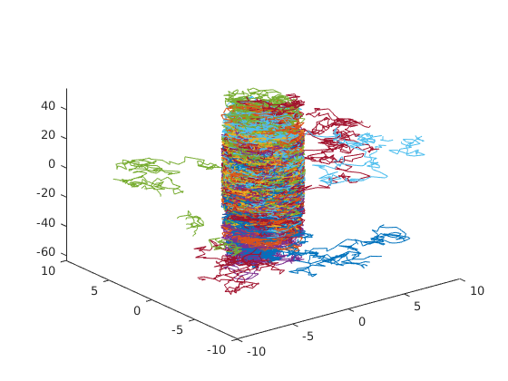

[](https://doi.org/10.5281/zenodo.1323319) [](https://travis-ci.org/davidnsousa/mcsd) [](http://joss.theoj.org/papers/887b1b7792d59ea6582a4700f8ff98ad)

# MCSD: MATLAB/Octave tool for Monte-Carlo simulations of diffusion in biological tissues


Author: David N. Sousa


MCSD is a simple MATLAB/Octave tool designed to simulate diffusion processes in complex environments such as biological tissues.


## Contents

            
- Getting started
- Details
- Examples
- Contributing

## Getting started


The following folders need to be added to your Matlab Search path (via `addpath`, `pathtool`, etc.):


```matlab
mcsd/mcsd
```


## Details


The following functions are provided:


  - `cells` - designs 1,2 and 3-D cell environments according to a user defined cell radii distribution .
  - `rwalkfree` - computes the random walk of multiple particles in the absence of barriers.
  - `rwalk` - generates the random walk of multiple particles in the presence of barriers.
  - `displacement` - calculates the displacement of the particles in all orthogonal directions.
  - `cmeasures` - calculates a user-defined measure of the particles' displacement distribution in all cartesian directions, including compartmental components.
  - `where` - indicates what particles are inside or outside compartments at a specific time frame/step.
  - `fanisotropy` - calculates the fractional anisotropy of diffusion.

For details about these functions input and output parameters use the Matlab help function `help` followed by the name of the function (e.g. `help rwalk`), or you can access the documentation at `mcsd/doc/index.tml`. In MATLAB the Statistics and Machine Learning Toolbox is required for a complete functioning of this package. MCSD is compatible only with MATLAB versions above R2016b. If backward compatibility is needed please see issue [#16](https://github.com/davidnsousa/mcsd/issues/16).

A tutorial and a replication script (in MATLAB) for the tutorial can be found at the MCSD github repository.

## Examples


**Example 1**


2-dimensional random walk of 3 particles. 1000 steps of step-size 1. All particles start at the origin. The output plot shows all particles' trajectories represent by a different colors.


```matlab
% parameters
initial_position = zeros(2,3);
number_of_steps = 1000;
step_size = 1;

% generate random walks
X = rwalkfree(initial_position, number_of_steps, step_size);

% plot random walks
plot(X(:,:,1),X(:,:,2));
```




**Example 2**


2-dimensional random walk of 1000 particles. 100 steps of step-size 1. All particles start at the origin and are confined to an elongated.


```matlab
% parameters; compartments are defined by anonymous functions
initial_position = zeros(2, 1000);
number_of_steps = 100;
step_size = 1;
cell = @(x, y) sqrt((x / 10) ^ 2 + y ^ 2) < 3;

% generate random walks
X = rwalk(initial_position, number_of_steps, step_size, cell);

% plot random walks
plot(X(:,:,1),X(:,:,2));
axis([-20 20 -10 10]);
```




The following calculates and plots the histogram of the particles' displacement distributions. dx1 and dx2 are the horizontal and vertical components of the displacement.


```matlab
% calculate the displacement of every particle
dx = displacement(X);

% plot displacement distribution
hist(dx, 20)
legend('dx_1', 'dx_2')
```




**Example 3**


2-dimensional random walk of 1000 particles. 100 steps of step-size 1. All particles start in random positions inside or outside cells.


```matlab
% parameters; compartments are defined by anonymous functions
initial_position = randi([-5 5], 2, 1000);
number_of_steps = 100;
step_size = 1;
cell_radii = [4 3 2 2];
packing_region = [-5 5 -5 5];
C = cells(cell_radii, packing_region);

% generate random walks
X = rwalk(initial_position, number_of_steps, step_size, C);

% plot the random walk of only 100 particles
plot(X(:,1:100,1),X(:,1:100,2));
```




Find the displacement distribution for inside and outside particles:


```matlab
% calculate the displacement of every particle
dx = displacement(X);

% find inside and outside particles
[in, out] = where(X, C, 1);

% plot displacement distributions
s1 = subplot(2,2,1);
hist(dx(in,1))
title('dx_{1} inside')
s2 = subplot(2,2,2);
hist(dx(in,2))
title('dx_{2} inside')
s3 = subplot(2,2,3);
hist(dx(out,1))
title('dx_{1} outside')
s4 = subplot(2,2,4);
hist(dx(out,2))
title('dx_{2} outside')
axis([s1 s2 s3 s4],[min(min(dx)) max(max(dx)) 0 200])
```




**Example 4**


3-dimensional random walk of 100 particles inside a permeable tube. 1000 steps of step-size 1. All particles start at the origin.


```matlab
clf

% parameters; compartments are defined by anonymous functions
initial_position = zeros(3, 100);
number_of_steps = 1000;
step_size = 1;
tube = @(x, y, z) sqrt(x ^ 2 + y ^ 2) < 3;
crossing_probability = 0.0005;

% generate random walks
X = rwalk(initial_position, number_of_steps, step_size, tube, crossing_probability);

% 3-D plot of random walks
plot3(X(:,:,1), X(:,:,2), X(:,:,3));
axis([-10 10 -10 10 min(min(X(:,:,3))) max(max(X(:,:,3)))]);
```




**Example 5**


Consider the more realistic example of water diffusion in the nervous system, more specifically along axonal membranes. To create such an environment we use the `cells` function to generate a 2-dimensional cell environment and add one degree of freedom to the output. Consider only four cells as previously and a normal distribution of the cell radii with mean 0.005 mm and standard deviation 0.0025 mm. We use the MATLAB/Octave built-in function `normrand`. The cells are packed in a square region of side length `l`. At 37&ordm; temperature the coefficient of free diffusion in water is the specified value `D` (see the code below). The diffusion time interval `t` is typical of an MRI scan, and the random walk time-step is given by `dt`. The random walk is t/dt steps long, and the step size is calculated from the mean square displacement formula derived from the Einstein's PDF in three dimensions (see the code below). The following simulates the 3D random walk of 100 particles in the specified conditions, and calculates all diffusion components in intracellular and extracellular compartments. The first line of the output matrix refers to the horizontal and vertical components of diffusion, and the second and third lines refer to intracellular and extracellular diffusion values respectively. Finally we compute the diffusion tensor and fractional anisotropy.


```matlab
% parameters; compartments are defined by anonymous functions
D = 0.003;
t = 0.026;
dt = 0.000025;
l = 0.02;
initial_position = rand(3, 100) * l;
number_of_steps = t / dt;
step_size = sqrt(6 * D * dt);
C = cells(normrnd(0.005, 0.0025, 1, 4), [0 l 0 l]);
axons = @(x, y, z) C(x,y);

% generate random walks
X = rwalk(initial_position, number_of_steps , step_size, axons);

% calculate diffusion
diffusion = @(dx) var(dx) / (2 * t);
D = cmeasures(diffusion, X, axons)

%Diffusion tensor and fractional anisotropy
dx = displacement(X);
DT = cov(dx) / (2 * t)
FA = fanisotropy(DT)
```


```

D =

    0.0010    0.0017    0.0029
    0.0003    0.0003    0.0003
    0.0018    0.0018    0.0018


DT =

    0.0010   -0.0000   -0.0000
   -0.0000    0.0017   -0.0001
   -0.0000   -0.0001    0.0029


FA =

    0.4628


```

## Contributing

[Contribution guidelines for this project](.github/CONTRIBUTING.md)

<sub>[Published with MATLAB R2018a]("http://www.mathworks.com/products/matlab/")</sub>
